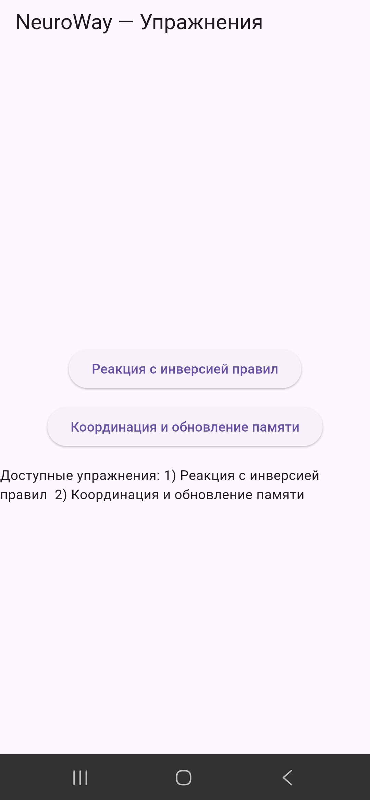
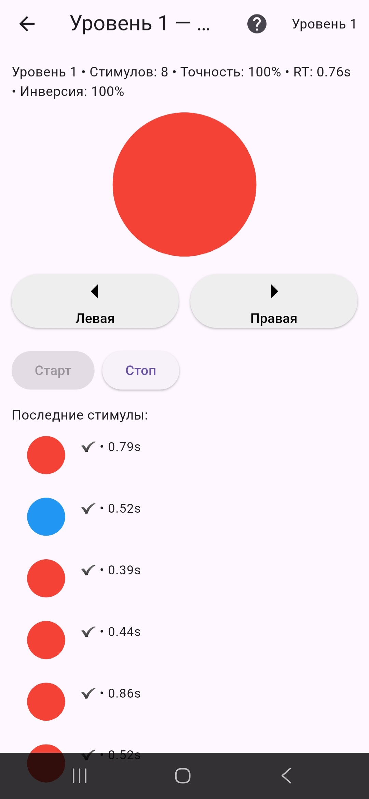
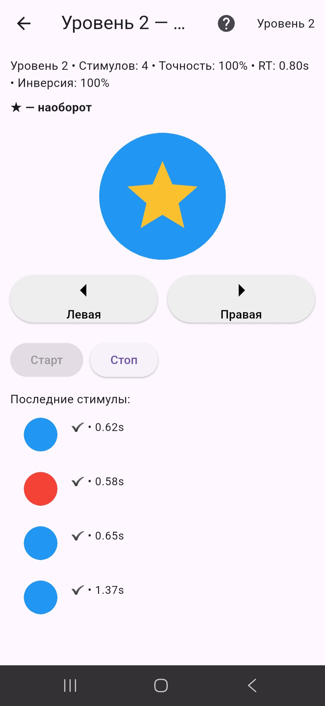
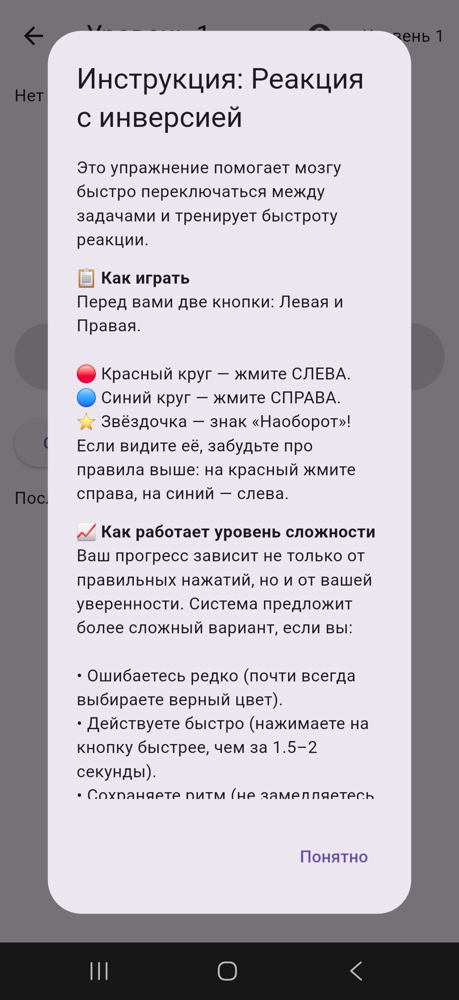
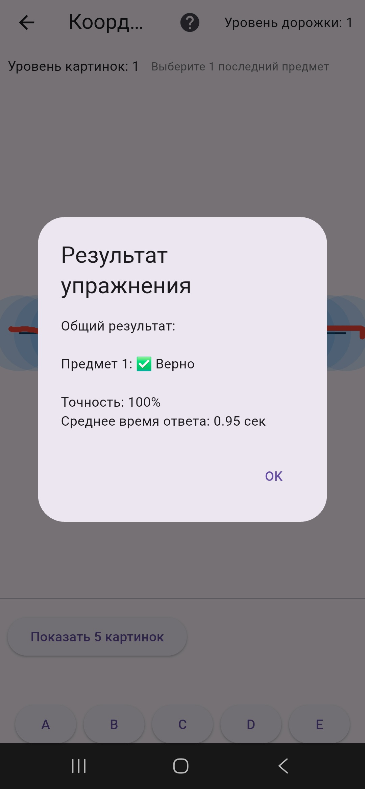
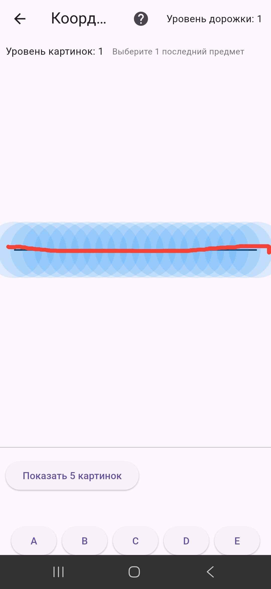
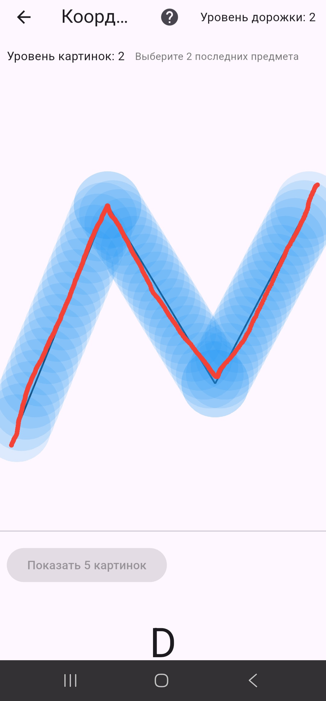

# NeuroWay 🧠📱

Мобильное приложение для дуальных когнитивно-моторных упражнений, разработанное для поддержки людей с болезнью Альцгеймера.

## Скриншоты интерфейса

  
  
  
  
  
  
  

## Ключевые особенности и алгоритмы
* **Конечный автомат:** динамическое управление уровнями сложности на основе метрик стабильности сессий.
* **Математический трекинг:** расчёт евклидова расстояния (`meanDeviation`) и коэффициента выхода за пределы дорожки (`outOfPathRatio`) в реальном времени.
* **Асинхронные вычисления:** фоновая обработка геометрических координат для поддержания высокой плавности интерфейса.

## Технологический стек
* Dart, Flutter
* Библиотека `dart:math`